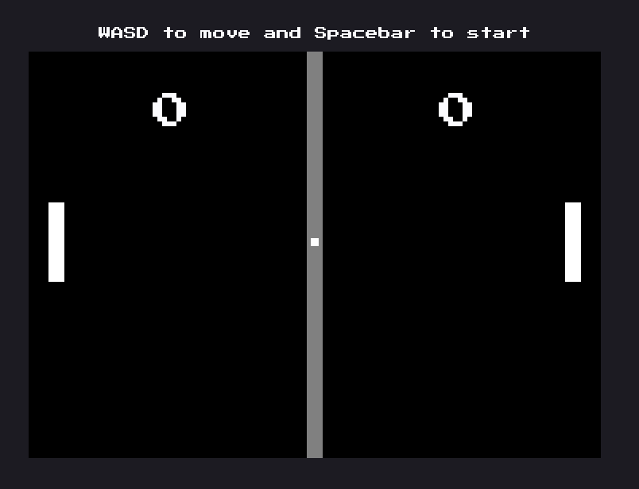

# Pong using Javascript

This is a practice project using javascript to recreate pong

## Table of contents

- [Overview](#overview)
  - [The challenge](#the-challenge)
  - [Screenshot](#screenshot)
  - [Links](#links)
- [My process](#my-process)
  - [Built with](#built-with)
  - [What I learned](#what-i-learned)
  - [Continued development](#continued-development)
- [Author](#author)

## Overview

### The challenge

Users should be able to:

- Play a simple game of pong
- See updating scoreboard based on who won

### Screenshot



### Links

- Solution URL: [GitHub](https://github.com/Sengsith/pong)
- Live Site URL: [Netlify](https://ahreo-pong.netlify.app/)

## My process

### Built with

- Javascript

### What I learned

This is the first project I finished by myself mainly using javascript and canvas. I implemented simple classes for the player, enemy, and ball. This project helped solidified my understanding of drawing simple shapes onto the canvas and tested my logical thinking skills for a simple game. The part that gave me the hardest trouble was figuring out the collision detection between the ball and the 3 main sides of the paddle.
```js
function determineCollision(paddle1, paddle2) {
  if ((ball.sides.right >= paddle2.sides.left &&
    ball.sides.left <= paddle2.sides.right &&
    ball.sides.bottom >= paddle2.sides.bottom &&
    ball.sides.top <= paddle2.sides.bottom) || 
    (ball.sides.left <= paddle1.sides.right &&
    ball.sides.right >= paddle1.sides.left &&
    ball.sides.bottom >= paddle1.sides.bottom &&
    ball.sides.top <= paddle1.sides.bottom)) return 'top';
  else if ((ball.sides.right >= paddle2.sides.left &&
    ball.sides.left <= paddle2.sides.right &&
    ball.sides.bottom >= paddle2.sides.top &&
    ball.sides.top <= paddle2.sides.top) ||
    (ball.sides.left <= paddle1.sides.right &&
    ball.sides.right >= paddle1.sides.left &&
    ball.sides.bottom >= paddle1.sides.top &&
    ball.sides.top <= paddle1.sides.top)) return 'bottom';
  else if (ball.sides.right >= paddle2.sides.left &&
    ball.sides.top <= paddle2.sides.bottom &&
    ball.sides.bottom >= paddle2.sides.top && 
    ball.sides.left <= paddle2.sides.left) return 'right';
  else if (ball.sides.left <= paddle1.sides.right &&
    ball.sides.top <= paddle1.sides.bottom &&
    ball.sides.bottom >= paddle1.sides.top &&
    ball.sides.right >= paddle1.sides.right) return 'left';
  else if (ball.sides.top <= 0 || ball.sides.bottom >= canvas.height) return 'wall';
}
```
The function above was what I came up with. I spent a few hours figuring it out but didn't want to spend too much time on one thing and wanted to finish up the project. The returned strings was then fed into a swithc statement:
```js
const collided = determineCollision(player, enemy);
switch (collided) {
  case 'top':
    ball.velocity.y = ball.constantVelocity;
    break;
  case 'right':
    ball.velocity.x = ball.constantVelocity * -1;
    determineYVelocity(enemy);
    break;
  case 'bottom':
    ball.velocity.y = ball.constantVelocity * -1;
    break;
  case 'left':
    ball.velocity.x = ball.constantVelocity;
    determineYVelocity(player);
    break;
  case 'wall':
    ball.velocity.y = ball.velocity.y * -1;
}
```

### Continued development

While the functionality of a pong game is there, I would definitely want to try to refactor my velocity logic as it seems quite messy and redundant in certain areas like my switch statement.
```js
function determineYVelocity(paddle) {
  if (ball.velocity.y > 0 && paddle.velocity < 0) {
    ball.velocity.y = ball.constantVelocity * -1;
  } else if (ball.velocity.y < 0 && paddle.velocity > 0) {
    ball.velocity.y = ball.constantVelocity;
  } else if (ball.velocity.y === 0 && paddle.velocity !== 0) {
    ball.velocity.y = paddle.velocity;
  }
}
```
My function above works well when figuring out the y velocity for when the ball collides with the top and bottom walls, but I would have liked to figure out a way to adjust the function to accomdate for all situations because other areas in my switch statement also change the y velocity of the ball without calling the function.
